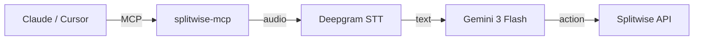

# Splitwise MCP Server

[](https://modelcontextprotocol.io)
[](https://pypi.org/project/splitwise-mcp/)

A Model Context Protocol (MCP) server that integrates with [Splitwise](https://splitwise.com). Connect your AI assistant (Claude, Cursor, etc.) to manage Splitwise expenses using natural language — with voice support!

## How It Works



## Features

| Tool | Description |
|------|-------------|
| `voice_command` | Send audio → Deepgram transcribes → Gemini processes → Splitwise executes |
| `text_command` | Send text → Gemini processes → Splitwise executes |
| `add_expense` | Add expenses with support for groups, percentages, exclusions, and specific payers |
| `delete_expense` | Delete an expense by ID |
| `list_friends` | List your Splitwise friends |
| `configure_splitwise` | Configure API credentials |
| `login_with_token` | Login with OAuth2 token |

**Smart Name Matching**: If Deepgram transcribes "Humeet" but your friend is "Sumeet", Gemini will ask for clarification instead of guessing.

### Advanced Splits
- **Percentages**: "Split 40% for me and 60% for Alice"
- **Groups**: "Add to Apartment group" (Auto-fetches members)
- **Exclusions**: "Add to Apartment but exclude Bob"
- **Payer**: "Alice paid $50"
- **Deletion**: "Delete expense 12345"

## Installation

### Option 1: Install from PyPI (Recommended)

```bash
pip install splitwise-mcp
```

### Option 2: Install from Source

1. **Clone the repository**:
   ```bash
   git clone https://github.com/hubshashwat/the-splitwise-mcp.git
   cd the-splitwise-mcp
   ```

2. **Create and activate a virtual environment**:
   ```bash
   python3 -m venv .venv
   source .venv/bin/activate
   ```

3. **Install the package**:
   ```bash
   pip install -e .
   ```

### Configuration

You'll need API keys from three services:

1. **Splitwise API Keys** (https://secure.splitwise.com/apps/new)
   - Register a new application
   - Get: Consumer Key, Consumer Secret, and API Key

2. **Gemini API Key** (https://aistudio.google.com/)
   - Create API key (free tier available)

3. **Deepgram API Key** (https://console.deepgram.com/)
   - Sign up and get API key (free tier available)

**Set environment variables** in your shell or add to your Claude Desktop config (see below).

## Usage

You can use this server in **two ways**:

### Option A: Standalone Terminal Agent (No Claude Required!) 🖥️

Run the voice/text agent directly in your terminal:

```bash
# Install the package
pip install splitwise-mcp

# Download the agent script
curl -O https://raw.githubusercontent.com/hubshashwat/the-splitwise-mcp/main/run_agent.py

# Set environment variables
export SPLITWISE_CONSUMER_KEY="your_key"
export SPLITWISE_CONSUMER_SECRET="your_secret"  
export SPLITWISE_API_KEY="your_api_key"
export GEMINI_API_KEY="your_gemini_key"
export DEEPGRAM_API_KEY="your_deepgram_key"

# Run the agent
python run_agent.py
```

**Commands:**
- `v` or `voice` - Record 10 seconds of audio and process it
- `t` or `text` - Type your command
- `q` or `quit` - Exit

**Example session:**
```
🤖 Splitwise Voice Agent
Enter command (voice/text/quit): t
Enter request: Add expense of $50 with John for dinner

⚠️  Proposed Action:
   Function: add_expense
   Args: {
     "description": "dinner",
     "cost": 50.0,
     "split_with": ["John"]
   }

Proceed? (yes/edit/cancel): yes
✅ Expense added!
```

### Option B: With MCP Clients 💬

This server uses **stdio transport** and works with **all MCP-compatible clients**:

#### Claude Desktop

Add to your config:
- **macOS**: `~/Library/Application Support/Claude/claude_desktop_config.json`
- **Windows**: `%APPDATA%\Claude\claude_desktop_config.json`

```json
{
  "mcpServers": {
    "splitwise": {
      "command": "splitwise-mcp",
      "env": {
        "SPLITWISE_CONSUMER_KEY": "your_consumer_key",
        "SPLITWISE_CONSUMER_SECRET": "your_consumer_secret",
        "SPLITWISE_API_KEY": "your_api_key",
        "GEMINI_API_KEY": "your_gemini_key",
        "DEEPGRAM_API_KEY": "your_deepgram_key"
      }
    }
  }
}
```

Then in Claude: *"Add an expense of $50 with John for dinner"*

#### Claude CLI

Use the same config format with `claude-cli --mcp-config`.

#### Cursor / VS Code (Antigravity, Cline, Continue.dev)

Add to your MCP settings (`.vscode/settings.json` or Cursor settings):

```json
{
  "mcp.servers": {
    "splitwise": {
      "command": "splitwise-mcp",
      "env": {
        "SPLITWISE_CONSUMER_KEY": "your_consumer_key",
        "SPLITWISE_CONSUMER_SECRET": "your_consumer_secret",
        "SPLITWISE_API_KEY": "your_api_key",
        "GEMINI_API_KEY": "your_gemini_key",
        "DEEPGRAM_API_KEY": "your_deepgram_key"
      }
    }
  }
}
```

Then you can ask your AI assistant: *"Use Splitwise to add an expense..."*

#### Other MCP Clients

This server is compatible with any MCP client supporting stdio transport. Use the same configuration pattern.

---

**Note**: If you installed from source instead of pip, use the full path to the executable:
- **macOS/Linux**: `"/path/to/the-splitwise-mcp/.venv/bin/splitwise-mcp"`
- **Windows**: `"C:\\path\\to\\the-splitwise-mcp\\.venv\\Scripts\\splitwise-mcp.exe"`

### Remote Access (SSE)

To run the MCP server over HTTP for remote clients:

```bash
.venv/bin/uvicorn splitwise_mcp.sse:app --host 0.0.0.0 --port 8000
```

Connect via: `http://YOUR_IP:8000/sse`

## Development

Run tests:
```bash
.venv/bin/python tests/test_logic.py
```

## Troubleshooting

### Microphone Issues (macOS)
If the agent says "Recording finished" immediately but captures no audio (Volume: 0.0), your terminal likely lacks microphone permission.

1. Go to **System Settings > Privacy & Security > Microphone**.
2. Enable access for your terminal app (Terminal, iTerm, VS Code, etc.).
3. **Restart your terminal** for changes to take effect.


## License

MIT
