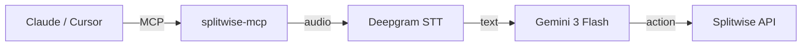

# Splitwise MCP Server

[](https://modelcontextprotocol.io)
[](https://smithery.ai/server/splitwise-mcp)

A Model Context Protocol (MCP) server that integrates with [Splitwise](https://splitwise.com). Connect your AI assistant (Claude, Cursor, etc.) to manage Splitwise expenses using natural language — with voice support!

## How It Works



## Features

| Tool | Description |
|------|-------------|
| `voice_command` | Send audio → Deepgram transcribes → Gemini processes → Splitwise executes |
| `text_command` | Send text → Gemini processes → Splitwise executes |
| `add_expense` | Add expenses with support for groups, percentages, exclusions, and specific payers |
| `delete_expense` | Delete an expense by ID |
| `list_friends` | List your Splitwise friends |
| `configure_splitwise` | Configure API credentials |
| `login_with_token` | Login with OAuth2 token |

**Smart Name Matching**: If Deepgram transcribes "Humeet" but your friend is "Sumeet", Gemini will ask for clarification instead of guessing.

### Advanced Splits
- **Percentages**: "Split 40% for me and 60% for Alice"
- **Groups**: "Add to Apartment group" (Auto-fetches members)
- **Exclusions**: "Add to Apartment but exclude Bob"
- **Payer**: "Alice paid $50"
- **Deletion**: "Delete expense 12345"

## Installation

1. **Clone the repository**:
   ```bash
   git clone https://github.com/hubshashwat/the-splitwise-mcp.git
   cd the-splitwise-mcp
   ```

2. **Create and activate a virtual environment**:
   ```bash
   python3 -m venv .venv
   source .venv/bin/activate
   ```

3. **Install the package**:
   ```bash
   pip install -e .
   ```

4. **Configure API keys** — copy `.env.example` to `.env`:
   ```bash
   cp .env.example .env
   ```

   Then edit `.env` with your keys:
   ```bash
   SPLITWISE_CONSUMER_KEY=...  # From Splitwise (https://secure.splitwise.com/apps/new)
   SPLITWISE_CONSUMER_SECRET=... # From Splitwise
   SPLITWISE_API_KEY=...       # From Splitwise
   GEMINI_API_KEY=...          # From Google AI Studio
   DEEPGRAM_API_KEY=...        # From Deepgram Console
   ```

## Usage

### With Claude Desktop

Add to `~/Library/Application Support/Claude/claude_desktop_config.json`:

```json
{
  "mcpServers": {
    "splitwise": {
      "command": "/path/to/splitwise-mcp/.venv/bin/splitwise-mcp"
    }
  }
}
```

Then in Claude: *"Add an expense of 50 with Sumeet for dinner"*

### With Cursor

Add to Cursor's MCP settings with the same command path.

### Terminal Agent (Optional)

For direct voice testing without an MCP client:

```bash
.venv/bin/python run_agent.py
```

Commands: `v` (voice), `t` (text), `q` (quit)

### Remote Access (SSE)

To run the MCP server over HTTP for remote clients:

```bash
.venv/bin/uvicorn splitwise_mcp.sse:app --host 0.0.0.0 --port 8000
```

Connect via: `http://YOUR_IP:8000/sse`

## Development

Run tests:
```bash
.venv/bin/python tests/test_logic.py
```

## Troubleshooting

### Microphone Issues (macOS)
If the agent says "Recording finished" immediately but captures no audio (Volume: 0.0), your terminal likely lacks microphone permission.

1. Go to **System Settings > Privacy & Security > Microphone**.
2. Enable access for your terminal app (Terminal, iTerm, VS Code, etc.).
3. **Restart your terminal** for changes to take effect.


## License

MIT
